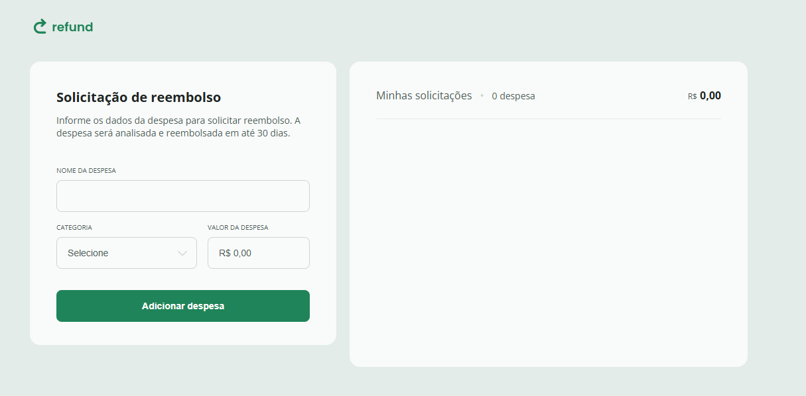

<h1> 🚀 Projeto prático - Sistema de reembolsos</h1>

  

## 🚀 Tecnologias

Esse projeto foi desenvolvido com as seguintes tecnologias:

- HTML
- CSS
- javaScript
- Git e Github
- Figma

## 💻 Projeto

Página web de um sistema de reembolso.
Este projeto foi realizado no curso de Fullstack da Rocketseat como projeto prático no módulo de JavaScript Intermediário.
